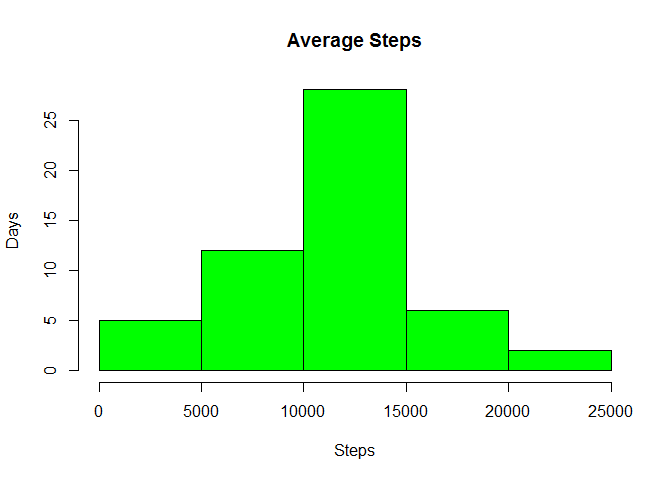
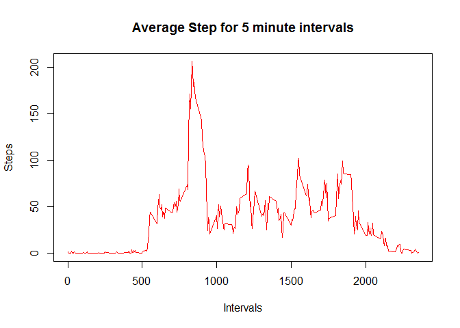
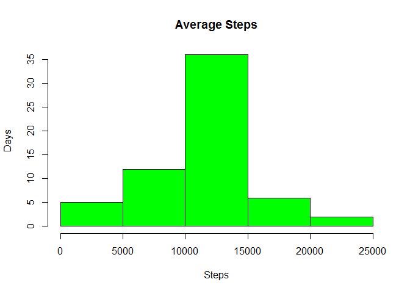
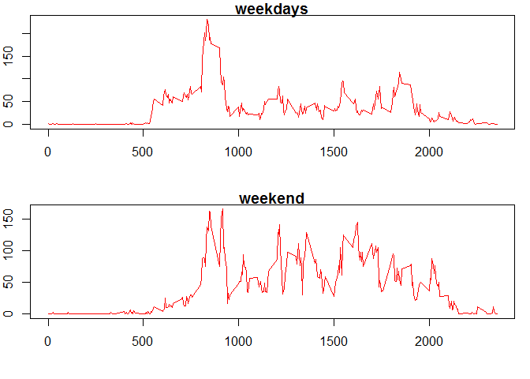

Course Project 1
================

1.  Loading library

<!-- -->

    ## Warning: package 'dplyr' was built under R version 3.3.1

    ## 
    ## Attaching package: 'dplyr'

    ## The following objects are masked from 'package:stats':
    ## 
    ##     filter, lag

    ## The following objects are masked from 'package:base':
    ## 
    ##     intersect, setdiff, setequal, union

Loading and preprocessing the data
----------------------------------

1.  Load the Data

<!-- -->

    mydataset <- read.csv('/Coursera/course5/activity.csv')

1.  Process/transform the data

<!-- -->

    mydataset$cdate <- as.Date(mydataset$date,'%Y-%m-%d')

What is mean total number of steps taken per day?
-------------------------------------------------

1.  Calculate the total number of steps taken per day

<!-- -->

    mysteps <- na.omit(mydataset)
    groupsteps <-summarise(group_by(mysteps,cdate),steps=sum(steps))

1.  Make a histogram of the total number of steps taken each day

<!-- -->

    hist(groupsteps$steps,xlab="Steps",ylab = "Days",main = "Average Steps",col="green")

3.Calculate and report the mean and median of the total number of steps
taken per day

    steps_mean <- mean(groupsteps$steps)
    steps_median <- median(groupsteps$steps)

The mean of steps is 10766 and the meadian is 10765

What is the average daily activity pattern?
-------------------------------------------

1.Make a time series plot of the 5-minute interval

    intervalsteps <-summarise(group_by(mysteps,interval),steps=mean(steps))
    plot(intervalsteps$interval,intervalsteps$steps,type = "l",col="red",xlab = "Intervals",ylab = "Steps",main = "Average Step for 5 minute intervals")

1.  Which 5-minute interval, on average across all the days in the
    dataset, contains the maximum number of steps?

<!-- -->

    maxsteps <-intervalsteps[which.max(intervalsteps$steps),1]

Then interval with the max steps is 835

Imputing missing values
-----------------------

1.Calculate and report the total number of missing values in the dataset

    sum(is.na(mydataset$steps))

    ## [1] 2304

The missing values are 2304

2.Devise a strategy for filling in all of the missing values in the
dataset. The strategy does not need to be sophisticated. For example,
you could use the mean/median for that day, or the mean for that
5-minute interval, etc.

I will fill the na's with the mean of 5-minute interval, which is
already calculated.

3.Create a new dataset that is equal to the original dataset but with
the missing data filled in.

First I rename the column steps in the table intervalsteps, thenn I
merge the data of the original table with the mean of each interval to a
new column, then I find the na and finally I put the mean of steps to
the na of step valus.

    names(intervalsteps) <- c("interval","steps_mean")
    mydatacomplete <- merge(mydataset,intervalsteps,by="interval")
    allnas <- is.na(mydatacomplete$steps)
    mydatacomplete$steps2[allnas] <- mydatacomplete$steps_mean[allnas]
    mydatacomplete$steps2[!allnas] <- mydatacomplete$steps[!allnas]

1.  Make a histogram of the total number of steps taken each day and
    Calculate and report the mean and median total number of steps taken
    per day

<!-- -->

    groupsteps2 <-summarise(group_by(mydatacomplete,cdate),steps=sum(steps2))
    hist(groupsteps2$steps,xlab="Steps",ylab = "Days",main = "Average Steps",col="green")

    steps_mean2 <- mean(groupsteps2$steps)
    steps_median2 <- median(groupsteps2$steps)

The mean of steps is 10766 and the meadian is 10766, and as we can see
are the same.

Are there differences in activity patterns between weekdays and weekends?
-------------------------------------------------------------------------

1.  Create a new factor variable in the dataset with two levels
    "weekday" and "weekend" indicating whether a given date is a weekday
    or weekend day.

<!-- -->

    mydatacomplete$weekday<-weekdays(mydatacomplete$cdate)
    mydatacomplete$dayfactor[mydatacomplete$weekday=="Sunday"|mydatacomplete$weekday=="Saturday"]<-"weekend"
    allnas2 <- is.na(mydatacomplete$dayfactor)
    mydatacomplete$dayfactor[allnas2]<- "weekdays"
    head(mydatacomplete)

    ##   interval steps       date      cdate steps_mean   steps2  weekday
    ## 1        0    NA 2012-10-01 2012-10-01   1.716981 1.716981   Monday
    ## 2        0     0 2012-11-23 2012-11-23   1.716981 0.000000   Friday
    ## 3        0     0 2012-10-28 2012-10-28   1.716981 0.000000   Sunday
    ## 4        0     0 2012-11-06 2012-11-06   1.716981 0.000000  Tuesday
    ## 5        0     0 2012-11-24 2012-11-24   1.716981 0.000000 Saturday
    ## 6        0     0 2012-11-15 2012-11-15   1.716981 0.000000 Thursday
    ##   dayfactor
    ## 1  weekdays
    ## 2  weekdays
    ## 3   weekend
    ## 4  weekdays
    ## 5   weekend
    ## 6  weekdays

1.  Make a panel plot containing a time series plot of the 5-minute
    interval (x-axis) and the average number of steps taken

<!-- -->

    weekdayval<-mydatacomplete[mydatacomplete$dayfactor=="weekdays",]
    weekendval<-mydatacomplete[mydatacomplete$dayfactor=="weekend",]
    intervalstepsweekday <-summarise(group_by(weekdayval,interval),steps=mean(steps2))
    intervalstepsweekend <-summarise(group_by(weekendval,interval),steps=mean(steps2))
    par(mfrow=c(2,1),mar= c(4, 2, 1, 1) )
    plot(intervalstepsweekday$interval,intervalstepsweekday$steps,type = "l",col="red",main = "weekdays",xlab = "")
    plot(intervalstepsweekend$interval,intervalstepsweekend$steps,type = "l",col="red",main = "weekend",xlab = "")

As we can see there is more activity in the morning of weekdays, and
during the day in weekends.
